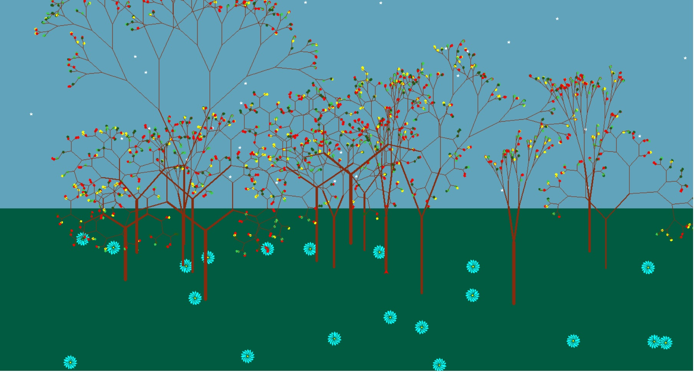

## how to code a jungle with python turtle

## STEP1
importing turtle and random library
<pre>
import turtle as t
import random
</pre>

## STEP2
defining functions for the details like stars, flowers, leaves, tree, etc.
<pre>
def star():
    t.pencolor("white")
    t.fillcolor("white")
    t.begin_fill()
    for _ in range(5):
        t.forward(5)
        t.right(144)
    t.end_fill()

def flower():
    for i in range(16):
        t.fillcolor("aqua")
        t.begin_fill()
        t.right(90)
        t.circle(10,90)
        t.left(90)
        t.circle(10,90)
        t.right(180)
        t.circle(2,24)
        t.end_fill()
    t.fillcolor("yellow")
    t.begin_fill()
    t.circle(2)
    t.end_fill()

def color():
    col = random.randint(1,5)
    if col == 1:
        return "#1A5D1A"
    elif col == 2:
        return "yellow"
    elif col == 3:
        return "#3CCF4E"
    else:
        return "red"

def leaf(n):
    colorr= color()
    t.pencolor(colorr)
    t.fillcolor(colorr)
    t.begin_fill()
    for i in range(n):
        t.right(360/n)
        t.fd(3)
    t.end_fill()

def tree(d,a,c):
    t.pensize(c)
    if d < 5 or a < 5:
        return
    if d < 10:
        leaf(5)
        return
    t.pencolor("#862B0D")
    t.forward(d)
    t.left(a)
    tree(d*(random.randint(5, 8)*0.1), a, c*0.5)
    t.right(2*a)
    tree(d*(random.randint(5, 8)*0.1), a, c*0.5)
    t.left(a)
    t.pencolor("#862B0D")
    t.back(d)

</pre>

## STEP3
desplaying the details, adding earth and sky, using random library to put stars, flowers and trees in some limited random area
and at the end using turtel.mainloop() prompt to make the picture stay longer.
<pre>
#sky
t.bgcolor("#61A3BA")

t.tracer(0)

#star
for i in range(50):
    t.pencolor("white")
    t.fillcolor("white")
    t.begin_fill()
    t.penup()
    t.setpos(random.randint(-1000,1000), random.randint(-100,500))
    t.pendown()
    star()
    t.end_fill()

#earth
t.penup()
t.setpos(-2000,-50)
t.pendown()
t.pencolor("#005B41")
t.fillcolor("#005B41")
t.begin_fill()
t.forward(4000)
t.right(90)
t.forward(1000)
t.right(90)
t.forward(4000)
t.right(90)
t.forward(1000)
t.right(90)
t.end_fill()

t.left(90)
t.tracer(0)

#flower
for i in range(20):
    t.penup()
    t.setpos(random.randint(-700,700),random.randint(-380,-100))
    t.pendown()
    # t.pencolor("green")
    t.fillcolor("green")
    t.begin_fill()
    #bush(random.randint(10,35), random.randint(5,30))
    flower()
    t.end_fill()
    t.update()

t.seth(90)

t.tracer(0)

#tree
for i in range(15):
    t.penup()
    t.setpos(random.randint(-600,600), random.randint(-250,-110))
    t.pendown()
    tree(random.randint(100,170), random.randint(5,60),random.randint(3,8))
    t.update()

t.update()
t.mainloop()
</pre>

 
 
 

here is the picture of my jungle
 

 

<!-- [my favorite website](http://www.google.com) -->

---
**Test**: This is atest
