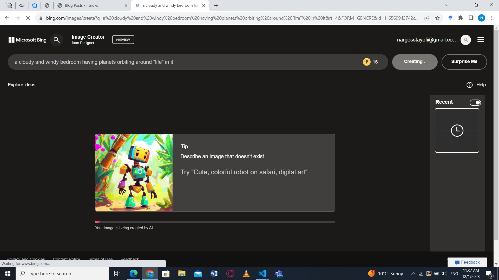

# Creating an Art Picture with AI Bing

## STEP1

googling "bing.com/images/create"
 

.png "STEP1")
 

## STEP2

defining a picture in our mind to have it created by bing
 

.jpg "STEP2")
 

## STEP3

hiting "create" botton and wait...
 

 

## STEP4

recieving what we wanted even more artistic
 

.png "STEP4")
 

---